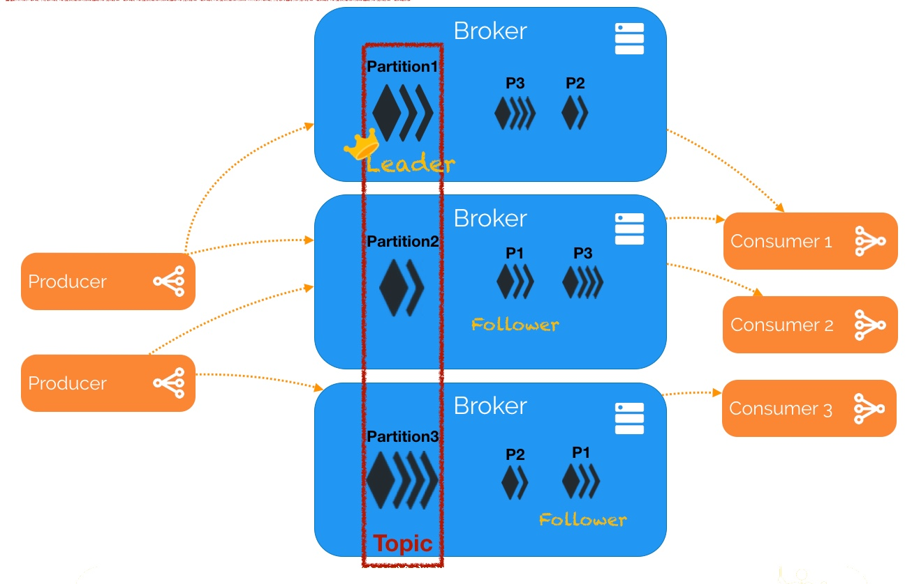
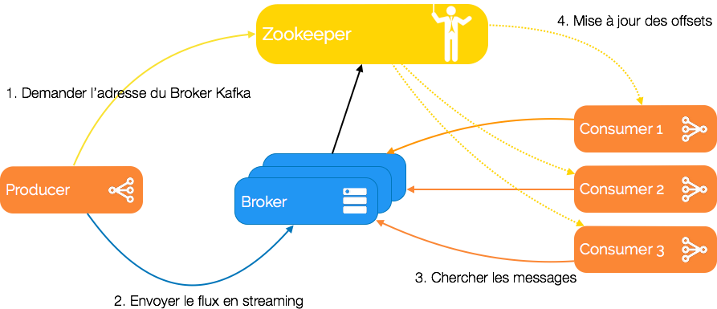

# Lab 3: Data Ingestion using MoM Apache Kafka

You can find [here](https://insatunisia.github.io/TP-BigData/tp3/) the Lab's Page.

Using Windows and VSCode I encountered some problems, so I used commands rather than relying on the extensions or VSCode itself when it comes to building the code. This makes it applied to other platforms and text editors or IDEs.

## Lab Objective

Running ***Apache Kafka with Zookeeper*** for **data ingestion** and integrating them with ***Apache Spark***.

### Explaining briefly the terms

- **Apache Kafka:**.
- **Apache Spark:**.
- **Apache Zookeeper:**.

**Here is a Kafka Setup example**:
.

**Here is the architecture with Zookeeper on consideration:**
.
This text is written in french. So here is what it means:

1. Ask for the Kafka Broker's adress.
2. Send the data in streaming.
3. Find the messages.
4. Update the offsets.

## Prerequesites

- Apache Zookeeper (found in Docker ) version .
- Apache Kafka ( found in Docker ) version .
- Apache Spark ( found in Docker ) version 3.5.
- Apache Hadoop ( found in Docker ) version 3.3.6.
- Maven.
- Java 8 (new versions are incompatible with Hadoop, I guess the latest version supported is Java 17).
- Docker.
- You would need to install **hadoop windows** for ***Local Testing***: files included are *winutils.exe*, *hadoop.dll* and *hdfs.dll*. You can find these [here](https://github.com/cdarlint/winutils).

**NOTE:** Don't forget to add them to your path and add these variables too: *JAVA_HOME* and *HADOOP_HOME*.

**NOTE2:** Downloading a good Java 8 in windows feels like a hustle so after many trials here is the best one: Installers provided by [Adoptium](https://adoptium.net/fr/temurin/releases/?package=jdk&version=8&os=windows&arch=x64).

## How to run each one of the servers

I setted up the `pom.xml` so you can run the three main functions without changing the file.

- Run SparkKafkaWordCount `mvn exec:java -Pwordcount`.
- Run SimpleProducer `mvn exec:java -Pproducer`
- Run SimpleConsumer `mvn exec:java -Pconsumer`.
